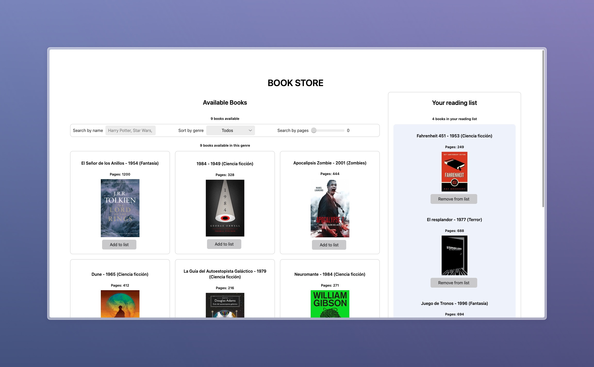

# Bookstore App: Technical Interview Project

The Bookstore App is a project developed as part of a technical interview process. It showcases a dynamic web application designed for book enthusiasts. The application allows users to explore a collection of books, manage a personalized reading list, and filter books by genre. This project demonstrates the candidate's ability to implement a range of web development features and their proficiency in managing application state and data persistence.

## Core Features Implemented

- **Available Books Display**: Users can browse through a list of available books, providing an engaging and interactive experience for exploring different titles.

- **Reading List Creation**: The application enables users to create a personalized reading list from the available books. It offers a clear UI distinction between books in the reading list and those that are not, along with the functionality to move books between lists.

- **Book Filtering by Genre**: This feature allows users to filter the book collection by genre, enhancing the book selection process. It includes a counter for the total number of books available, the number in the reading list, and the number available in the selected genre.

- **State Synchronization**: The app ensures global state synchronization to accurately reflect the number of books in the reading list and those available. This feature updates the counts accordingly when books are moved between lists.

- **Data Persistence**: Data persistence is achieved through the use of browser's local storage, ensuring that the reading list is maintained even after the page is reloaded.

## Upcoming Features

- **Tab Synchronization**: Future enhancements will include tab synchronization to reflect changes across multiple browser tabs without the need for a backend.

- **Deployment**: Plans for deployment on a free hosting service are underway, which will make the application accessible via a public URL.

- **Testing**: The application will incorporate at least one test to ensure the reliability and performance of its most crucial features.

## Project Context

This project was developed as part of a technical interview, aiming to demonstrate the candidate's skills in web development, particularly in React (or the relevant framework used), state management, and user interface design. The features implemented and planned reflect a comprehensive approach to building a functional and user-friendly web application.

## Inspiration

This project is inspired by the work of [midudev](https://github.com/midudev), a well-known programmer in the web development community. Midudev's contributions to the field, particularly in React and modern web development practices, have been a guiding light for this project.